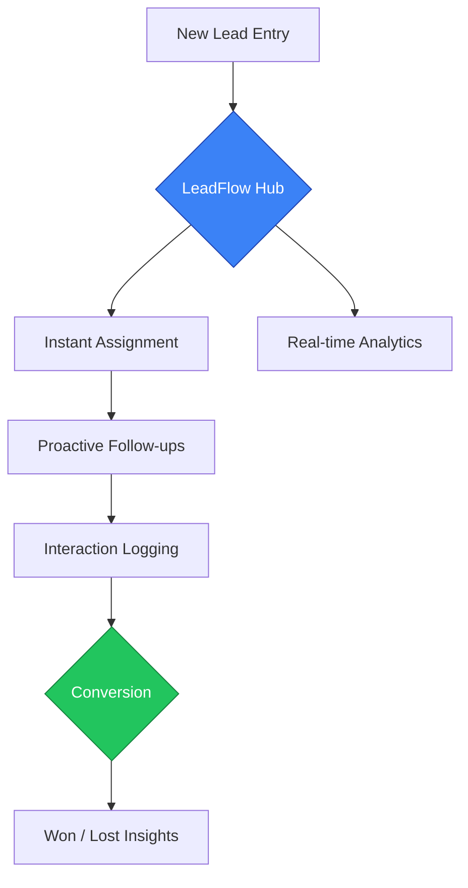
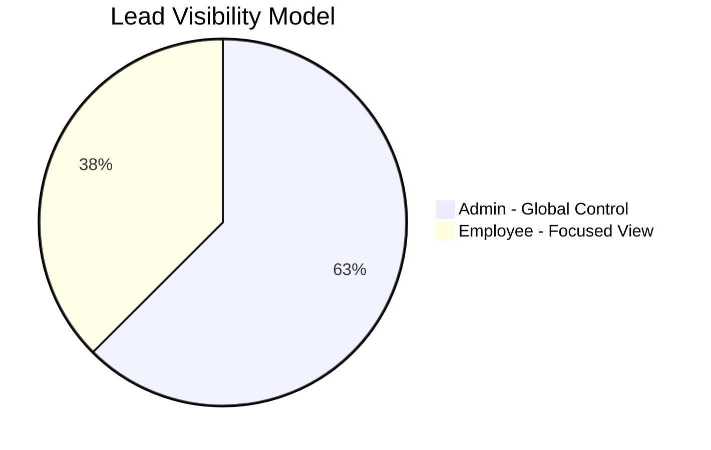

# 🚀 LeadFlow CRM
### *A Personal Project — Lead Management & Sales Intelligence Platform*

*Designed, developed, and maintained as a personal product project*

---

## 🧐 Project Overview

**LeadFlow CRM** is a personal project built to solve a common real-world problem in sales teams:  
**lead leakage caused by fragmented tools, delayed follow-ups, and poor visibility.**

The goal of this project was to design a **fast, intuitive, and reliable lead management system** that feels more like desktop software than a traditional web app.

LeadFlow tracks the complete lifecycle of a prospect — from first inquiry to conversion — using **real-time synchronization**, **activity intelligence**, and **minimal operational friction**.

---

## 🔄 The LeadFlow Journey

## 🌟 Core Functionalities

### 📋 Intelligent Lead Management
A high-performance lead management hub with dynamic table views and advanced multi-parameter filtering.  
The **Inline-Edit System** allows instant updates directly from the main view, reducing repetitive data entry.

---

### ⏳ Proactive Follow-Up System
LeadFlow acts as a built-in sales assistant.  
It continuously evaluates follow-up schedules and highlights leads as **Overdue**, **Due Today**, or **Upcoming**, ensuring nothing slips through the cracks.

---

### 📞 Interaction & Call Intelligence
Every interaction is logged and preserved.  
The **Call History module** creates a chronological record of conversations, pain points, and next steps, maintaining full context even when ownership changes.

---

### 📊 Data-Driven Dashboard
A high-level overview of sales activity, including:

- Conversion rates  
- 30-day lead generation trends  
- Workload distribution across users  

This dashboard was designed to encourage **data-backed decision making** rather than intuition.

---

## 🔐 Governance & User Roles

To simulate real-world CRM usage, LeadFlow includes a **Role-Based Access Control (RBAC)** system.

| Role | Access Scope | Purpose |
|----|----|----|
| 👑 **Administrator** | Global | User management, lead reassignment, analytics visibility |
| 👤 **Employee** | Assigned Leads Only | Focused pipeline management and follow-ups |

## 🛠️ Technical Philosophy

### 1️⃣ Consistency
Built with a standardized UI system (**Shadcn UI**) to maintain a clean, predictable interface across all modules.

### 2️⃣ Reliability
Uses **PostgreSQL (Supabase)** with **Row Level Security (RLS)** and real-time data synchronization to ensure correctness and trust in data.

### 3️⃣ Efficiency
Optimized server-state management delivers a **desktop-like experience** with instant updates and minimal loading time.

---

## 🗺️ Roadmap & Future Vision

This project is actively evolving. Planned improvements include:

- **Omnichannel Integration**  
  Native WhatsApp and Email interactions inside lead profiles

- **Automated Reminders**  
  Smart system-generated follow-up alerts

- **AI Insights**  
  Predictive lead scoring based on interaction history and engagement patterns

---

## 📄 About This Project

**LeadFlow CRM** is a personal, end-to-end product project.

It showcases:
- System design & architecture  
- Real-world business problem solving  
- Role-based access control  
- Data modeling & security  
- Product thinking beyond CRUD applications  

---

## 👤 Author

Developed with ❤️ by **Yash Bhilare**  
*Software Engineer | Product Builder*

<a href="#top">⬆️ Back to Top</a>

